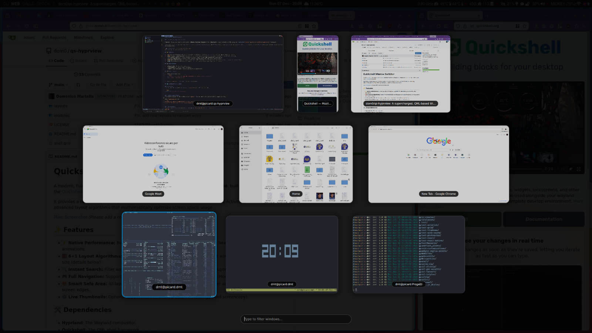
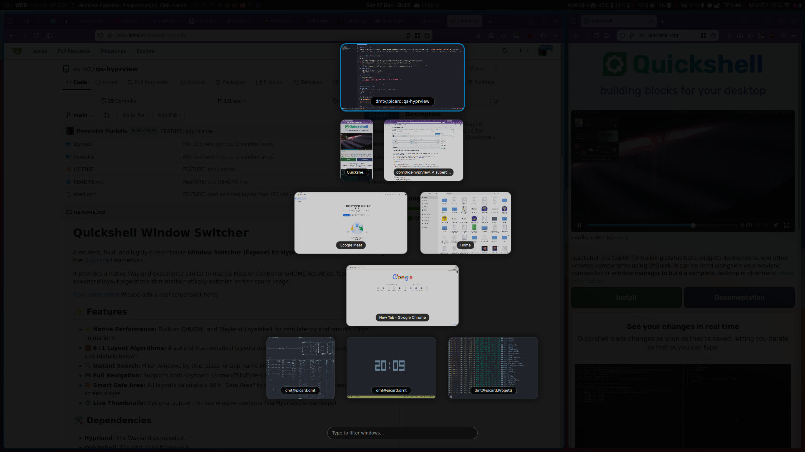
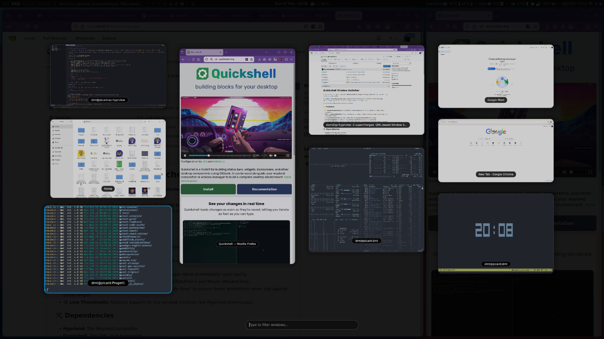
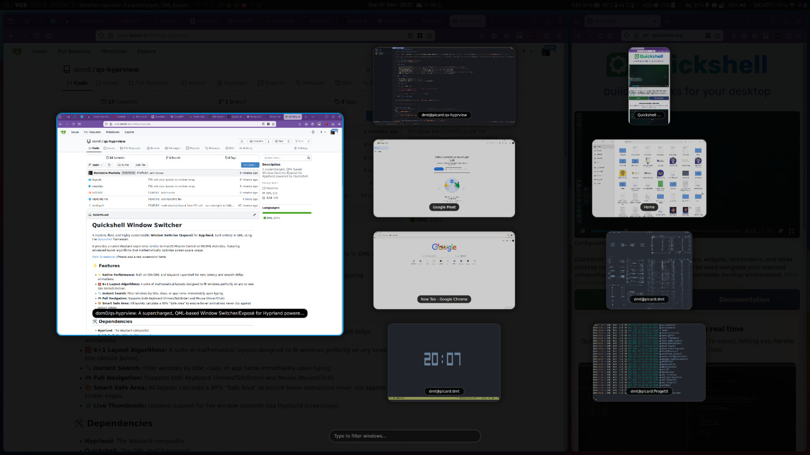
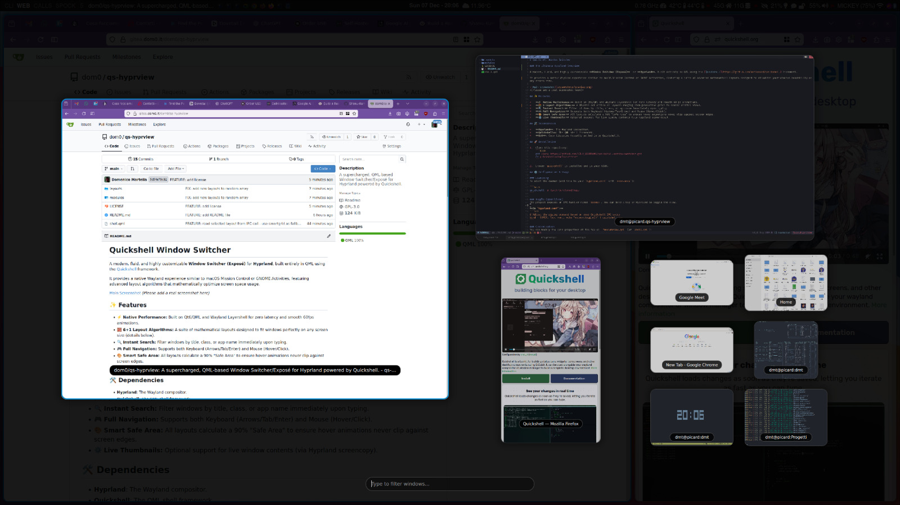
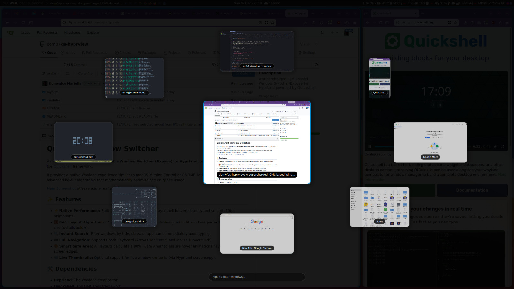

# Quickshell Window Switcher

### The ultimate Hyprland Overview

A modern, fluid, and highly customizable **Window Switcher (Exposé)** for **Hyprland**, built entirely in QML using the [Quickshell](https://github.com/outfoxxed/quickshell) framework.

It provides a native Wayland experience similar to macOS Mission Control or GNOME Activities, featuring a suite of advanced mathematical layouts designed to visualize your windows beautifully on any screen size.

## 📸 Gallery

See `qs-hyprview` in action with its different layout algorithms.

| | | |
| :---: | :---: | :---: |
| <br>**Smart Grid** | <br>**Bands** | <br>**Masonry** |
| <br>**Hero** | <br>**Spiral** | <br>**Satellite** |

## ✨ Features

*   **⚡ Native Performance:** Built on Qt6/QML and Wayland Layershell for zero latency and smooth 60fps animations.
*   **🧮 9 Layout Algorithms:** A collection of layouts ranging from productive grids to scenic orbital views.
*   **🔍 Instant Search:** Filter windows by title, class, or app name immediately upon typing.
*   **🎮 Full Navigation:** Supports both Keyboard (Arrows/Tab/Enter) and Mouse (Hover/Click).
*   **🎨 Smart Safe Area:** All layouts calculate a 90% "Safe Area" to ensure hover animations never clip against screen edges.
*   **⚙️ Live Thumbnails:** Live window contents via Hyprland screencopy.

## 🛠️ Dependencies

*   **Hyprland**: The Wayland compositor.
*   **Quickshell**: The QML shell framework.
*   **Qt6**: Core libraries (usually pulled in by Quickshell).

## 🚀 Installation

1.  Clone this repository:
    ```bash
    git clone https://github.com/dom0/qs-hyprview.git
    ```

2.  Ensure `quickshell` is installed and in your PATH.

## ⚙️ Configuration & Usage

### Launching
To start the daemon (add this to your `hyprland.conf` with `exec-once`):

```bash
quickshell -p /path/to/cloned/repo

# Or clone into $XDG_CONFIG_HOME/quickshell (usually ~/.config/quickshell) and run with -c flag:
quickshell -c qs-hyprview
```

### Toggle (Open/Close)
The project exposes an IPC handler named `expose`. You can bind a key in Hyprland to toggle the view.

**In `hyprland.conf`:**
```ini
# Available: "smartgrid", "justified", "masonry", "bands", "hero", "spiral",
#            "satellite", "staggered", "columnar", "random"
$layout = 'masonry'
bind = $mainMod, TAB, exec, quickshell ipc -p /path/to/cloned/repo call expose toggle $layout

# Or, using XDG_CONFIG_HOME:
#bind = $mainMod, TAB, exec, quickshell ipc -c qs-hyprview call expose toggle $layout
```
### Visual optimizations

You can optimize your experience by adding an opaque/blurred background (dimming area) or pop-in animations using native Hyprland features.

**In `hyprland.conf`:**
```ini
# dimming area
decoration {
    dim_around = 0.8
}

layerrule = dimaround, quickshell:expose
```

```ini
# blur area
decoration {
    blur {
        enabled = true
        size = 3
        passes = 1
    }
}

layerrule = blur, quickshell:expose
```

```ini
# popin animation
animations {
    enabled = yes
    animation = layersIn, 1, 1.5, default, popin
}
```

### Customization
You can modify the core properties at the top of `shell.qml`:

```qml
// Set to true for live window updates (monitor refresh rate, higher CPU usage), false for static snapshots (~8fps)
property bool liveCapture: false

// Automatically move mouse cursor to the center of selected window
property bool moveCursorToActiveWindow: true
```

## 📐 Layout Algorithms

This project includes a sophisticated `LayoutsManager` offering **9 distinct algorithms**:

### 1. Smart Grid (`smartgrid`)
The default layout. It uses an **Iterative Best-Fit** algorithm. It simulates every possible row/column combination to find the exact grid configuration that results in the largest possible thumbnails without overflowing the screen.

### 2. Justified (`justified`)
A **Justified Layout** (similar to Google Images). It places windows in rows, maintaining fixed height and original aspect ratios, and scales the row to fit the screen width perfectly.

### 3. Masonry (`masonry`)
A **Waterfall** layout (Pinterest-style). It optimizes vertical space by placing windows in dynamic columns. It automatically calculates the optimal number of columns based on the window count.

### 4. Bands (`bands`)
Organizes windows by **Workspace**. Creates a horizontal "Band" for each active workspace, grouping relevant tasks together. Windows are justified within their workspace band.

### 5. Hero (`hero`)
A focus-centric layout.
*   **Hero Area:** The active window takes up 40% of the screen (left side).
*   **Stack:** All other windows share the remaining 60% (right side) in a smart grid or column.

### 6. Spiral (`spiral`)
A scenic layout based on the **Golden Ratio (BSP)**.
*   Windows split the screen in a spiral pattern (Left half, Top-Right half, etc.).
*   The first window is separated by a larger gap to emphasize focus.
*   If many windows are open, the spiral stops after 3 cuts and arranges the rest in a grid.

### 7. Satellite (`satellite`)
An **Orbital** layout.
*   The active window sits in the center of the screen.
*   All other windows orbit around it in an ellipse.
*   Visually stunning and great for focusing on one task while keeping an eye on the surroundings.

### 8. Staggered (`staggered`)
A **Honeycomb/Brick** layout.
*   Similar to a grid, but every odd row is shifted horizontally by half a cell width.
*   Creates a more organic, less rigid look compared to standard grids.

### 9. Columnar (`columnar`)
Divides the screen into vertical strips.
*   Ignores rows completely and gives every window maximum vertical space.
*   Excellent for **Ultrawide** monitors (21:9 / 32:9).

### 🎲 Random (`random`)
Feeling adventurous? This mode selects one of the above algorithms at random every time you open the dashboard.

## ⌨️ Controls

| Input | Action |
| :--- | :--- |
| **Typing** | Instantly filters windows by Title, Class, or App ID |
| **Arrows (↑ ↓ ← →)** | Spatial navigation between thumbnails |
| **Tab / Shift+Tab** | Sequential navigation |
| **Enter** | Activate selected window |
| **Middle Click** | Close hovered window |
| **Esc / Click BG** | Close dashboard |

## 🤝 Contributing

Pull Requests are welcome! If you want to add a new layout algorithm or improve performance, please open an issue or submit a PR.

## 📄 License

Distributed under the GNU General Public License v3.0. See `LICENSE` for more information.
